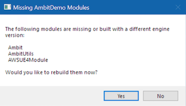

# Appendix: Contributing to Ambit Development

This section provides important information for anyone who would like to contribute to the development of the Ambit tools or to make custom modifications to Ambit for their own purposes. It covers technical setup and developer workflow. For general contributing guidelines and process, see the repository's [CONTRIBUTING.md file](https://github.com/aws-samples/aws-ambit-scenario-designer-ue4/blob/main/CONTRIBUTING.md).

> ✏️ This guide assumes you already have Unreal Engine development experience.

## Setup

Ensure you have completed the main [Setup > Initial Setup (One-Time)](../setup/#initial-setup-one-time) instructions from this user guide.

In addition to having Unreal Engine 4.27 installed, you will also need the Microsoft Visual Studio development tools required for UE4 C++ development. If you need help with these setup steps, refer to the Unreal Engine 4 documentation, especially ["Setting Up Visual Studio for Unreal Engine"](https://docs.unrealengine.com/4.26/en-US/ProductionPipelines/DevelopmentSetup/VisualStudioSetup/).

Create a new Unreal Engine C++ project to use as a host project while you work on Ambit development. There are no special configuration requirements for this project. The "Blank" project template with default settings will work just fine, but you can also customize the settings if you'd like.

Clone this repository into the "Plugins" folder of the UE project you created. Note, you will need to create the "Plugins" folder first.

`<your sample project>\Plugins\aws-ambit-scenario-designer-ue4\`

Once the Ambit plugin repository has been cloned, right-click on the `*.uproject` file at the root of the project directory and select the "Generate Visual Studio project files" option. Select the appropriate engine version if required. A new Visual Studio solution file (`*.sln`) will be generated for you.

Launch your sample project by clicking on the `*.uproject` file. When prompted to rebuild missing modules, click "Yes".

Once the project opens, enable the "Functional Testing Editor" plugin, and restart (or simply close) the editor for the plugin to take effect. This plugin is used to run Ambit's automated tests.

## Development Workflow

Follow this workflow when making changes to the Ambit C++ code...

1. Launch the project's `*.sln` file in Visual Studio. 
2. In the **Solution Explorer** window, right-click on your project and select **Set as Startup Project**. 
3. Make your code edits.
4. Compile and run the solution through either of these methods:
   1. To build only: Select `Build > Build Solution` from the Visual Studio menubar
   2. To build and run: Press the **Local Windows Debugger** button (or press **F5**).
5. Repeat steps 3-4 as needed.

## Testing

### Running Automated Tests

The Ambit plugin includes a number of automated tests. Automated test files, called "specs", end with a `*.spec.cpp` file extension and are usually located next to the files that they test. These tests will be automatically recognized by the Unreal Engine test runner. To run the tests:

1. First open the **Test Automation** window (`Window > Test Automation`).
2. Select the **Automation** tab.
3. Tick the box next to the **Ambit** group of tests.
4. Click the **Start Tests** button.

> 💡 **Tip:** For more info on working with automated tests in UE see ["Automation Spec Overview"](https://docs.unrealengine.com/en-US/Programming/Automation/AutomationSpec/index.html)

### Test Maps

A sample map is provided to aid in manual testing of the various Ambit spawner actors. You'll find that map at:

 `/Ambit Content/Test/Maps/ProceduralPlacementTestMap`

### Testing Scenario Import/Export

To manually test scenario import and export functionality, follow these steps:

1. First set some random parameters in the **Scenario Settings** section of the Ambit Mode.
2. Click the "Export Scenario" Button at the bottom of the **Scenario Settings** section and save the `*.sdf.json` file.
3. Verify the file was created in the destination location you specified.
4. Reset all the values of your **Scenario Settings** section or re-load the project.
5. Click the '...' next to **Scenario Name** and import the `*.sdf.json` file.
5. Confirm that all settings were restored as expected.

## Packaging a Release Build

To create packaged version of the plugin for distribution, follow these steps:

1. Click **Edit** tab and open **Plugins** window.
2. Find the **AWS Ambit Scenario Designer** plugin.
3. Click the **Package** button and choose the folder to which you would like to save the plugin.
4. Wait for the packaging process to complete and use the **Output Log** panel to check for any warnings or errors.

You can use this pre-built plugin in both Unreal Engine C++ and Blueprint Projects by installing it in your project's "Plugins" folder or the Engine "Plugins" folder.

## Contributing to the User Guide

To contribute to the User Guide, follow the instructions listed [here](https://github.com/aws-samples/aws-ambit-scenario-designer-ue4/blob/main/docs/user-guide/README.md).

## Dependencies

The Ambit plugin uses a subset of the AWS SDK for C++ to communicate with AWS services. A precompiled version of these libraries ([Version 1.9](https://github.com/aws/aws-sdk-cpp/tree/1.9.93)) has been included in this repository and encapsulated as a module called "AWSUE4Module".