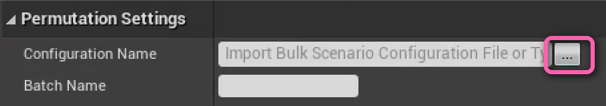

# Automated Scenario Generation

Ambit provides bulk scenario generation functionality. It does this by creating a batch of [individual SDFs](../manual-scenario-generation) based on making permutations from each setting specified. Alongside those it also has a standalone file called a [Bulk Scenario Configuration (BSC)](#utilizing-bulk-scenario-generation-file) file that indicates how the batch was created. 

Before getting started, make sure to have properly set up your [AWS Account](/aws-setup#setup).

## Customize Permutation Settings

The **Permutation Settings** menu can be found in **AWS Ambit Scenario Mode**, which allows for the settings of the permutations generated to be specified.


First select the **Time of Day Types** and **Weather Types** options as appropriate for creating permutations based on these settings. Refer to the Scenario Settings for how these will look as defaults when the generation happens.

Set the range of **Bulk Pedestrian Traffic** and **Bulk Vehicle Traffic**. These are both a percent value of 0 to 1, where 1 is representative of 100%. 
> **Note:** The current increment is 0.1.

The **Number of Permutations** represents how many scenarios will be generated. This value cannot be directly changed, and is for informative purposes only. 

## Generate Permutations

To generate the bulk permutations, set the **Configuration name** and **Batch Name** first in the **Permutation Settings** menu.

The Configuration name is the file name of BSC file. This also serves as the suffix for the folder where the batch SDFs are located.


The Batch name is the prefix of the SDFs. Ambit will automatically increment these based on the number of permutations.


Clicking **Generate Permutation** at the bottom of the **Permutation Settings** menu will export your batch to Amazon S3.


## Locating Export in Amazon S3

You can locate these files in Amazon S3 by going to your account and searching for the S3 bucket created.

Inside that bucket, there will be a file and a folder corresponding to the Configuration and Batch name specified above.
The file with the name of the Configuration will be the BSC that is used to control the Permutation Settings on import, as well as retain information for the Ambit Spawners to allow for re-importing.


The folder will contain all of the permutations that were made as SDFs. 


## Import Permutation Settings

If you would like to import your BSC from S3 bucket, you can input the configuration name, choose the AWS Region of S3 bucket where you store that file and input the bucket name, then click the "..." next to the **Configuration Name** field.



Once imported, all of the settings from the bulk configuration alongside the spawners will be placed back into the scene. 
> **Note:** **Spawn With Houdini** will not re-import the original HDA selected.

## Utilizing Bulk Scenario Generation File

The output file will be a `*.bsc.json` file, which follows JSON formatting. The specifications for this file are as follows: 
```yaml
Version: This is the version of BSC when it was initially uploaded. 
ConfigurationName: Refers to the Configuration Name field on screen. 
BulkScenarioName: Refers to the Batch Name screen on screen. 
TimeOfDayTypes: Refers to the permutation settings specified on screen relating to the time of day. For the individual values of these, refer to the Preset Time of Day field in the Scenario Settings. 
  Morning: Determines if the morning setting is a valid option for the permutations.
  Noon: Determines if the noon setting is a valid option for the permutations.
  Evening: Determines if the evening setting is a valid option for the permutations. 
  Night: Determines if the night setting is a valid option for the permutations.

WeatherTypes: Refers to the permutation setting specified on screen relating to the weather. For individual values of these, refer to the Weather Types and Weather Parameter fields in the Scenario Settings.
  Sunny: Determines if the preset Weather Type sunny is a valid option for the permutations.
  Rainy: Determines if the preset Weather Type rainy is a valid option for the permutations.
  Foggy: Determines if the preset Weather Type foggy is a valid option for the permutations.

PedestrianDensity: Determines the settings for the pedestrian density fields. 
  Min: The permutated value to begin with for the density of pedestrians. Represented as a percent [0,1]. 
  Max: The permutated value to end with for the density of pedestrians. Represented as a percent [0,1].
  Increment: The value that will increment for the permutation settings.

TrafficDensity: Determines the settings for the traffic density fields. 
  Min: The value to begin with for the permutations of the density of traffic. Represented as a percent [0,1]. 
  Max: The value to end with for the permutations of the density of traffic. Represented as a percent [0,1].
  Increment: The value that will increment for the permutation increment. 

NumberOfPermutations: The total number of permutations the settings generate. 
AllSpawnerConfigs: A list of spawner configurations by type. 
  AmbitSpawner*: An individual type of spawner that has specified values for it. Each spawner has its own settings.
```

To find the specification for the SDF, please refer to [this](../manual-scenario-generation/#scenario-definition-file-specification) section.

