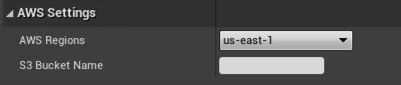

# Working with AWS in Ambit

Ambit integrates with [Amazon Simple Storage Service (Amazon S3)](https://docs.aws.amazon.com/AmazonS3/latest/userguide/Welcome.html) to help centralize various files into a cloud storage that can then be re-imported easily from any computer.

## Setup

To successfully utilize an Amazon S3 bucket, AWS credentials need to be configured in your environment for a role that has access to the Amazon S3 bucket. Follow [this guide](https://docs.aws.amazon.com/sdk-for-cpp/v1/developer-guide/credentials.html) for step-by-step instructions.

## Configure AWS Settings

Once the account has the correct permissions, find the **AWS Settings** menu inside of **AWS Ambit Scenario Mode**, then select the AWS region of your Amazon S3 bucket and input the bucket name. If the bucket doesn't already exist it will be automatically created for you.

> **Note:** Amazon S3 bucket names must adhere to the [bucket naming rules](https://docs.aws.amazon.com/AmazonS3/latest/userguide/bucketnamingrules.html)

Ambit will utilize this setting throughout to upload and download from the bucket specified.
