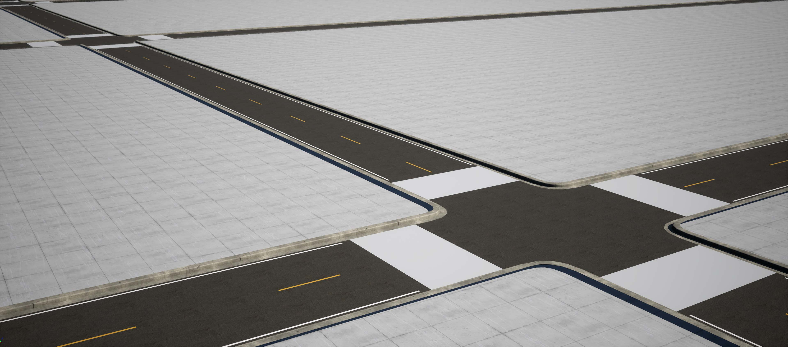

Ambit provides two tools which aid in the creation of complex real-world environments - **Ambit Building Generator** and **Ambit Road Generator**. These tools accept any [Open Street Map](https://www.openstreetmap.org/#map=17/47.61388/-122.33799) (OSM) file as input and generate 3D geometry that is simulation-ready.

> ⚠️ **Important:** These tools leverage the Houdini Engine. Be sure you have installed both the Houdini Engine and the Houdini plugin for Unreal before using these tools. See the [Setup](../setup) section of this user guide for instructions.

The **Ambit Building Generator** produces stylized buildings based on the building shapes contained in the OSM file.

The **Ambit Road Generator** produces roadways, complete with road markings, based on the road descriptions contained in the OSM file.

