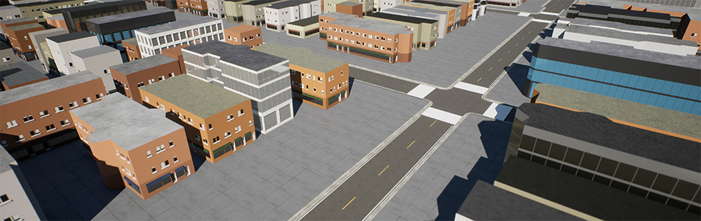
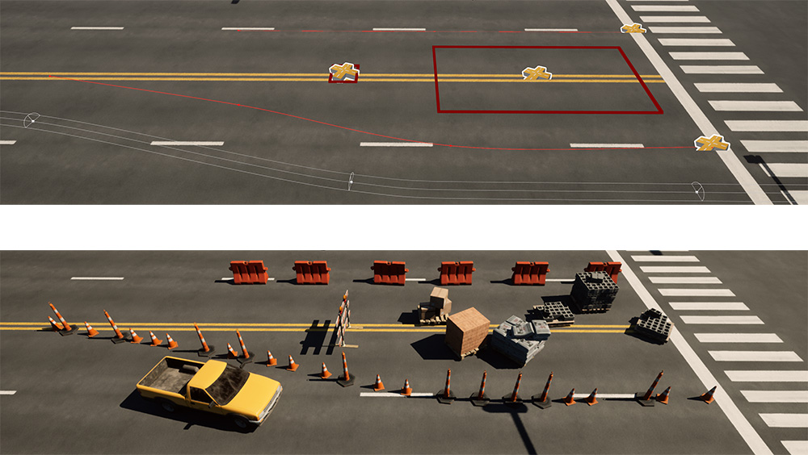
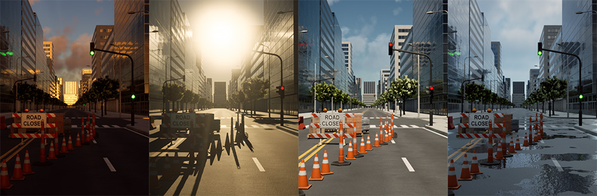
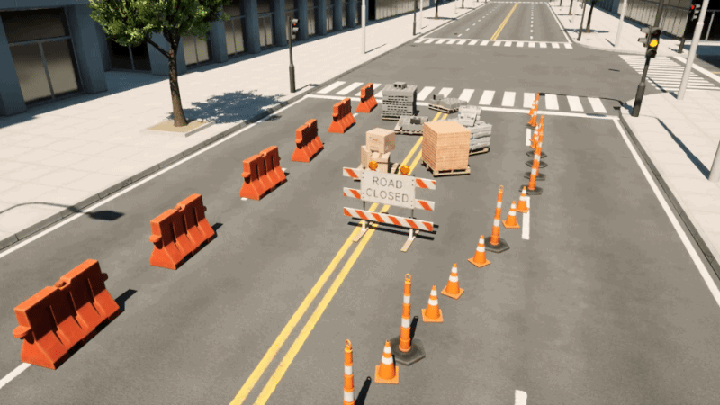

# Feature Overview

**World generation:** Automatically generate building and road geometry from [Open Street Map](https://www.openstreetmap.org/) data. Use nearly any location in the world as the basis for your 3D environment. Learn more about this feature in the [City Generation](../city-generation) section.

**Obstacle placement:** Quickly populate your 3D worlds with stationary objects and vehicles using simple rules-based tools. Leverage randomness parameters to create endless variations easily. Learn more about obstacle placement in the [Static Obstacles](../spawner-parent) and [Dynamic Obstacles](../spawn-vehicle-path-parent) sections.

<figcaption>Below, Ambit’s object placement tools are used to define paths and boundaries (top) for the automatic placement of various objects (bottom.)</figcaption>

**Environment FX:** Preview how time of day and weather conditions will impact the scenarios you create using Ambit’s drop-in environmental effects system. Learn more in the [Weather & Time of Day FX](../weather) section.

**Scenario generation:** A scenario is the encapsulation of the world, obstacles, time of day, and weather conditions for a single simulation. Scenarios are exported from Ambit as JSON-formatted text files that can be used in your own simulators and pipelines. Export individual scenarios manually, or let Ambit automatically generate hundreds of scenario permutations based on parameters you control. Learn more in the [Manual Scenario Generation](../individual-scenario-generation) and [Automated Scenario Generation](../bulk-scenario-generation) sections.

<figcaption>The layout of the construction zone below was created with Ambit’s obstacle placement tools. Then, variations were auto-generated as individual scenarios.</figcaption>

