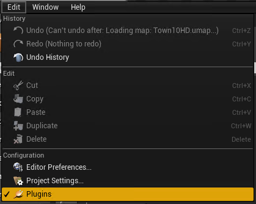
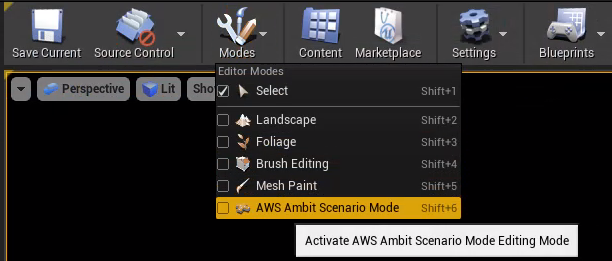
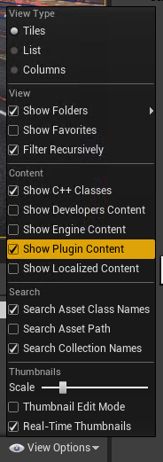
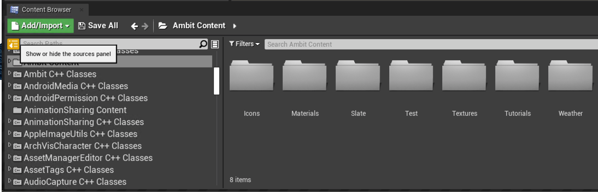

# Welcome to AWS Ambit Scenario Designer for Unreal Engine 4

AWS Ambit Scenario Designer for Unreal Engine 4 (Ambit) is a suite of tools to streamline content creation at scale for autonomous vehicle and robotics simulation applications.

Currently Ambit can be installed as a plugin for [Unreal Engine 4.27](https://docs.unrealengine.com/en-US/Support/Builds/ReleaseNotes/4_27/index.html).

## Getting Started

You can install the plugin either directly in the engine folder (in "Engine/Plugins/Editor/Ambit") or in your project folder (in "Plugins/Editor/Ambit").

Make sure the Ambit plugin is installed and enabled in your Unreal Engine installation by going to **Edit** -> **Plugins** and ensuring the **enabled** checkbox for Ambit is checked.

## AWS Ambit Scenario Mode

Once the plugin is enabled a new **AWS Ambit Scenario Mode** will be added to the **Modes** dropdown menu in the top panel. Select this Mode to enable scenario generation for your scene.

## Enabling Content

Once the Ambit plugin is installed and enabled you will need to enabled plugin content in your content browser to access some of Ambit's tools. To do this, go to the **View Options** dropdown in the bottom right hand corner of your content browser and select **"Show Plugin Content"**.

Then "Ambit Content" folder should be selected in the "Sources Panel" of the Content Browser.

## Note

During the usage of this plugin tool, Ambit may collect generic user metrics to inform us about the usage of this plugin tool. These metrics contain no identifiable info and are not shared or transferred.

If you prefer to opt out from this metrics collection, within the Ambit plugin folder, you can edit the C++ header file Source/Ambit/Utils/UserMetricsSubsystem.h to make the RecordUserMetrics field false.
