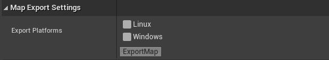
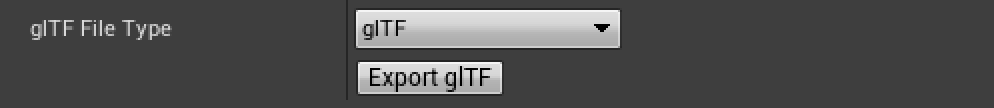

# Export Options

Ambit provides two export options:

1. To cook and export the current map: This option will contain all the files and folders required by Unreal Engine including Icons, Materials, Textures, etc.
2. To convert the map to glTF (glTF or GLB): This option exports either a single binary file (GLB) that contains all the associated texture and material information, or a glTF file along with all the texture files.

Both options export the map for a target platform and upload the contents to Amazon S3.

Before getting started, make sure to have properly set up your [AWS Account](/aws-setup#setup).

## Select TargetPlatforms And Export Map

You can find the **Map Export Settings** menu in **AWS Ambit Scenario Mode**.

First you can select the **Export Platforms** of your permutation via the checkboxes. **Note**: Platforms here mean standalone runtime platform.

Next you can click **Export Map** at the bottom of the **Map Export Settings** menu. The exported content with name ${MapName}_${Platform} will be uploaded to S3 bucket.

## Export as glTF

The second option to export the map is as glTF. After configuring the **AWS Settings** and selecting an **Export Platform**, you can select the target file type using the dropdown menu.

Once you click the **Export glTF** button, the converted map along with all other metadata (textures, materials, etc.) will be uploaded to the configured S3 bucket as a zipped folder in the format ${MapName}_${GltfFileType}.

> **Note:** This option only works if there is _at least_ one static mesh available for export. Any actors that aren't static mesh actors will not be exported, such as lighting, Ambit Spawners, etc.