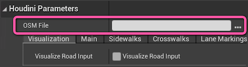

## Using the Ambit Road Generator (Experimental)

> 🧪 The Ambit Road Generator is currently considered experimental. There are many types of road configurations that it doesn't handle well at the moment.

Using the UE editor's Content Browser, navigate to the _**Ambit Content > ProceduralTools**_ folder. Then, right-click on the **AmbitRoadGenerator** and select **"Instantiate at the origin"**.

> ✏️ **Note:** If you don't see the **Ambit Content** folder listed in the Content Browser you will need to enable the "Show Plugin Content" option using the Content Browser's View Options menu.  You may also need to toggle the "Show/Hide Sources Panel" icon. 

There will be a small delay while the Houdini Engine starts in the background and then initializes the asset.

Ensure that the new **AmbitRoadGenerator** instance is selected in the World Outliner panel. Then, find the section of the Details panel titled _**Houdini Parameters**_. Import an OSM file that you downloaded previously by clicking the `…` icon next to the _**OSM File**_ parameter field.

Road generation will start automatically. Generation time may range from a few seconds to a few minutes.