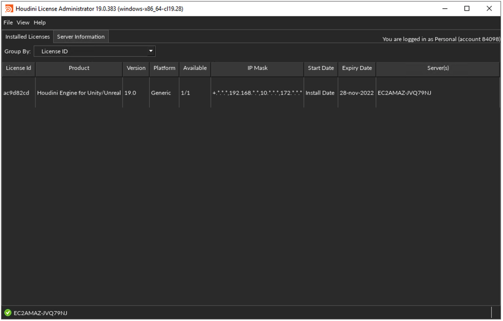

# Setup

## Initial Setup (One-Time)

Complete the following setup before using Ambit for the first time.

>  ⏱ Initial setup takes about 20 minutes.

> 🛑 These instructions assume you already have Unreal Engine 4.27 installed. If you don't, you can [download Unreal Engine for free](https://www.unrealengine.com/en-US/download). Choose the Unreal Engine license that is appropriate for your team. Ambit will work with any Unreal Engine license.

### 1. Download the Ambit plugin for UE4

Download the latest pre-built release of the Ambit UE4 plugin from the GitHub [Releases section](https://github.com/aws-samples/aws-ambit-scenario-designer-ue4/releases).

Unzip the file you downloaded. You may unzip it to any location that's convenient for you. It will unzip as a folder named "AwsAmbit".

We'll return to the Ambit plugin in later steps.

### 2. Install the AWS Command Line Interface

You will be configuring your computer to communicate with AWS services. The easiest way to do this is by installing the AWS Command Line Interface (CLI).

Install the AWS CLI to your local computer following the ["Install/Update" instructions on this page](https://docs.aws.amazon.com/cli/latest/userguide/getting-started-install.html). (You can ignore the "Next steps" section at the bottom of that page.)

### 3. Create AWS credentials for use with Ambit

Ambit integrates with Amazon's cloud storage service, [Amazon Simple Storage Service (S3)](https://docs.aws.amazon.com/AmazonS3/latest/userguide/Welcome.html). To enable this integration, you will need to provide AWS credentials that allow access to S3. 

The easiest way to generate these credentials is to create a new AWS Identity Access & Management (IAM) user in your AWS account. [Follow this guide](https://docs.aws.amazon.com/sdk-for-cpp/v1/developer-guide/credentials.html) to create a new IAM user having **AmazonS3FullAccess** permissions.

### 4. Install Houdini Engine for UE4

Some Ambit functionality leverages the **Houdini Engine**, a 3D content creation tool from SideFX. There are many flavors of Houdini available including a free version called "Houdini Engine for Unreal". That is the version we will use with Ambit.

Acquire a free license for Houdini Engine for Unreal by clicking the relevant "Add To Cart" button on [this web page](https://www.sidefx.com/buy/#houdini-engine-unreal-unity) and completing the checkout process.

Download and install the "Houdini Launcher" from the [SideFX download page](https://www.sidefx.com/download/).

Once installed, launch the Houdini Launcher.

Click the <number-badge>1</number-badge> "Install" button and select <number-badge>2</number-badge> the latest "Production Build" of Houdini 19.0.x.

When prompted with the Preferences dialog keep the default settings and enable the <number-badge>3</number-badge> "Unreal Plug-In" and <number-badge>4</number-badge> "Automatically Install SideFX Labs" options, then click <number-badge>5</number-badge> "Save".

Once installation completes click on the <number-badge>6</number-badge> "Licenses" tab. Then click the <number-badge>7</number-badge> "License Administrator" button.

Two windows will appear. The "Entitlements" window should display your available "Houdini Engine for Unity/Unreal" licenses. Set the <number-badge>8</number-badge> "Quantity" value to "1" and click the <number-badge>9</number-badge> "Install" button.

The remaining Houdini Administrator window should now reflect that you've successfully configured your Houdini license. You may close both this window and the Houdini Launcher.

Next, you'll add the Houdini Engine plugin to your Unreal Engine install. Do this by copying the "HoudiniEngine" folder from...

`C:\Program Files\Side Effects Software\Houdini Engine\Unreal\19.0.x\4.27\HoudiniEngine`

...to the following location...

`C:\Program Files\Epic Games\UE_4.27\Engine\Plugins\Runtime\HoudiniEngine`

### 4. Add the AWSAmbit.hda to your Houdini Engine install

The final part of setting up Houdini Engine is to copy one of the Ambit plugin files to your Houdini install folder. Recall that you downloaded the Ambit plugin in step 1. Find this file...

`[AwsAmbit plugin folder]\AWSAmbit.hda`

...and copy it to the following location, creating the "otls" directory if necessary...

`C:\Users\[username]\Documents\houdini19.0\otls\AWSAmbit.hda`

### 5. Install the glTF Exporter UE4 plugin

Some of Ambit's export functionality relies on the **glTF Exporter plugin** from Epic Games. This plugin doesn't ship with Unreal Engine but can be downloaded for free from the Unreal Engine Marketplace following the steps below.

Visit the [glTF Exporter Marketplace web page](https://www.unrealengine.com/marketplace/en-US/product/gltf-exporter).

If not already signed in, click the "Sign in to Buy" button and log in.

Once logged in, click the "Open in Launcher" button. This will take you to the same asset page in the Marketplace tab of the Epic Games Launcher.

Click the "Install to Engine" button and complete the installation.

Congratulations! Initial setup is now complete. 🎉

## Per Project Setup

Each time you create a new Unreal Engine project in which you'd like to use the Ambit tools you will need to add the Ambit plugin to your project following the steps below.

> ⏱ Project setup takes about 5 minutes.

Navigate to the Unreal Engine project to which you'd like to add Ambit. Inside that project folder create a "Plugins" folder (if it doesn't already exist.)

`[MyUnrealProject]\Plugins\`

Download the latest pre-built release of the Ambit UE4 plugin [here]() 🔥🔥🔥 *TODO: Update link when GitHub is ready.*

Unzip the file you downloaded. It will unzip as a folder named "AwsAmbit". Copy that folder to the "Plugins" directory you created above.

`[MyUnrealProject]\Plugins\AwsAmbit\`

Open your Unreal Engine project.

In the Content Browser, click the <number-badge>1</number-badge> "View Options" button and enable the <number-badge>2</number-badge>"Show Plugin Content" option. You should then see the <number-badge>3</number-badge> "Ambit Content" folder listed in the Sources pane. (You may need to toggle the  icon to reveal the Sources pane.)

Congratulations! Your project is now ready to go. 🎉