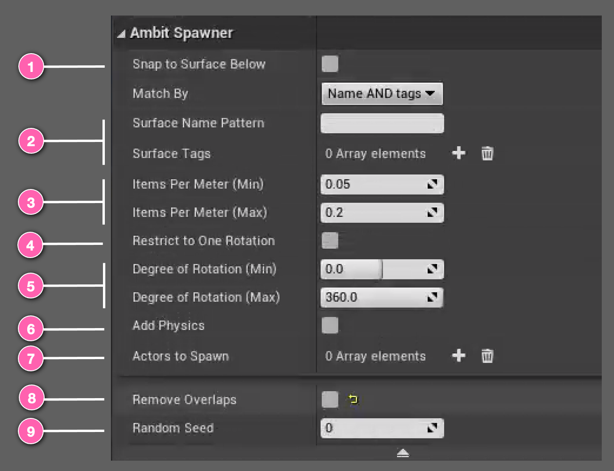

# Spawn in Volume Actor

The **Spawn in Volume** actor works by using the position of the actor and the pre-made _box component_ attached to the actor to determine the rectangular area where obstacles will be spawned. If the bounded area contains multiple surface types, you can fine tune the **Spawn in Volume**'s behavior by specifying by <number-badge>2</number-badge> surface name pattern and/or by tag (see [Ambit Spawner: How To Use Tags](/spawner-parent/#how-to-use-tags)). This will limit obstacles to spawn only on the surfaces that match your specifications within the bounded area. If you don't want to manually specify surfaces, there is also the option to <number-badge>1</number-badge> snap all spawned obstacles to _any_ surfaces below the bounded area. 

**Spawn in Volume** will use the <number-badge>3</number-badge> _density_ range and the <number-badge>5</number-badge> _rotation_ range you provide to instantiate copies of an Unreal Engine actor randomly selected from an <number-badge>7</number-badge> array of Unreal Engine actors you've chosen within the box component's bounds. If you want all spawned obstacles to face the same direction, you can select <number-badge>4</number-badge> _Restrict to One Rotation_ and **Spawn in Volume** will automatically update the range's maximum to equal its minimum. To enable physics simulation on your spawned obstacles, just select <number-badge>6</number-badge> _Add Physics_. By default, the **Spawn in Volume** will remove overlaps, but this behavior can be turned off by unselecting <number-badge>8</number-badge> _Remove Overlaps_. To change the placement pattern, just adjust the <number-badge>9</number-badge> _Random Seed_ value.

## Using Spawn in Volume

After adding a **Spawn in Volume** instance to your map you will see an icon like this. You can place it at any 3D location you'd like. The _position_ of the **Spawn in Volume** instance is the center of the bounding plane. You can **transform** the **Spawn in Volume** instance by rotation, translation, and scaling to adjust the rotation, position, and size of the box component. The box component's **dimensions** can also be changed in the **Shape** category of the Details panel.

If you specified surfaces for **Spawn in Volume** using _surface name pattern_ and/or _tags_, or if you choose _Snap to Surface Below_, **Spawn in Volume** will calculate the appropriate height (Z-axis) for each of the spawned obstacles. If no surfaces are specified _and_ Snap to Surface Below, then AmbitSpawnerBounding will its height for all of the spawned obstacles.

## Examples

It's easiest to understand the effect of each of the **Spawn in Volume** parameters by seeing them in action. You will find a variety of examples in the [Spawn in Volume Examples section](/spawner-examples/#spawn-in-volume-examples).