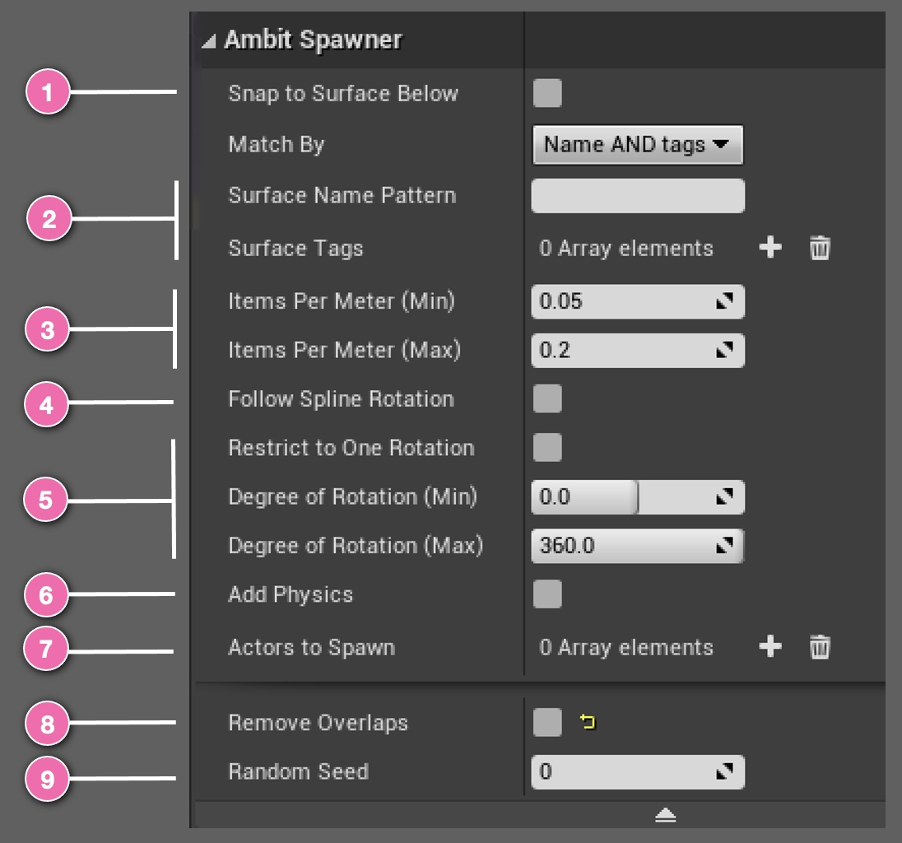
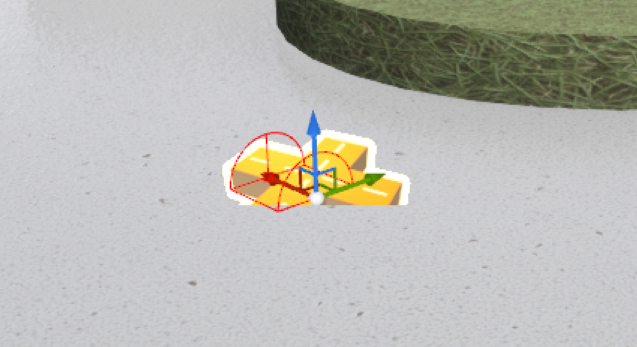

# Spawn on Path Actor
<TODO: Update UI image to reflect new interface>

The **Spawn on Path** actor works by using the position of the **Spawn on Path** and the pre-made _spline component_ attached to the actor to determine the path of the line or curve along which obstacles will be spawned. If the spline curve traverses multiple surface types, you can fine tune the **Spawn on Path**'s behavior by <number-badge>2</number-badge> _Surface Name Pattern_ and/or by _Surface Tags_ (see [Ambit Spawner: How To Use Tags](/spawner-parent/#how-to-use-tags)). This will limit obstacles to spawn only along portions of the spline curve that are above the specified surfaces. If you don't want to manually specify surfaces, there is also the option to <number-badge>1</number-badge> snap all spawned obstacles to _any_ surfaces below the path of the spline. 

**Spawn on Path** will use the <number-badge>3</number-badge> _density_ range to instantiate copies of the Unreal Engine actor randomly selected from an <number-badge>7</number-badge> array of Unreal Engine actors you've chosen within the box component's bounds. The orientation of all spawned objects can be controlled using the <number-badge>5</number-badge> _Degree of Rotation_ range, unless all spawned obstacles are required to face the same direction using _Restrict to One Rotation_, in which case the rotation will automatically update the range's maximum to equal its minimum. **Spawn on Path** also provides the option to <number-badge>4</number-badge> _Follow Spline Rotation_ to orient the objects relative to the spline rotation. To enable physics simulation on your spawned obstacles, just select <number-badge>6</number-badge> _Add Physics_. By default, the **Spawn on Path** will remove overlaps, but this behavior can be turned off by unselecting <number-badge>8</number-badge> _Remove Overlaps_. To change the placement pattern, just adjust the <number-badge>9</number-badge> _Random Seed_ value.

## Using Spawn on Path

After adding a **Spawn on Path** to your map you will see an icon like this. You can place it at any 3D location you'd like. The _position_ of the **Spawn on Path** instance is the starting point of the spline path. You can **transform** the **Spawn on Path** instance by rotation, translation, and scaling to adjust the orientation, position, and length of the spline. The spline component's spline points can be moved, created, and deleted directly in the **viewport** or through the **Selected Points** category of the Details panel.

If you specified surfaces for **Spawn on Path** using _surface name pattern_ and/or _tags_, or if you choose _Snap to Surface Below_, **Spawn on Path** will calculate the appropriate height (Z-axis) for each of the spawned obstacles. If no surfaces are specified _and_ Snap to Surface Below, then **Spawn on Path** will use its height for all of the spawned obstacles.

## Examples

It's easiest to understand the effect of each of the **Spawn on Path** parameters by seeing them in action. You will find a variety of examples in the [Spawn on Path Examples section](/spawner-examples/#spawn-on-path-examples).