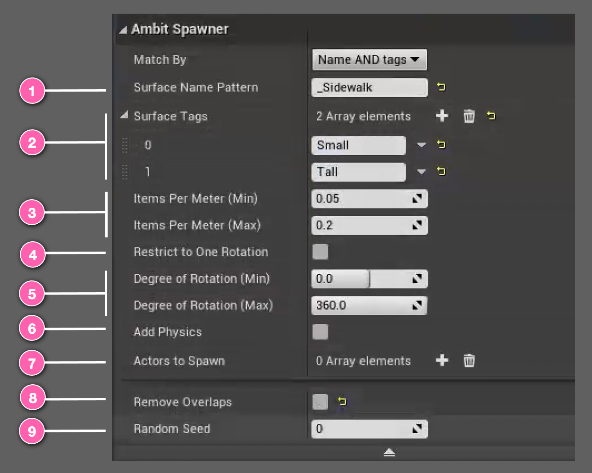
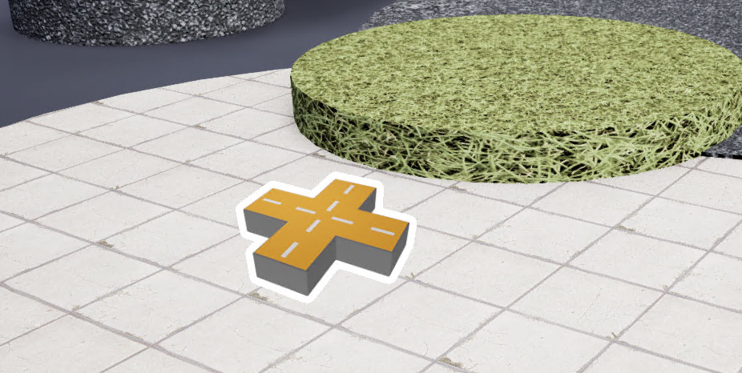

# Spawn on Surface Actor

One of the drag-and-drop tools is called **Spawn on Surface** actor. By configuring a few simple parameters on this instance, you can generate endless placement variations for anything from trash cans to tricycles, fire hydrants to foliage.

This works by querying the simulation world for _surfaces_ that you specify. Surfaces can be indicated by <number-badge>1</number-badge> _Surface Name Pattern_ <number-badge>2</number-badge> and/or by _Surface Tag_ (see [How To Use Tags](/spawner-parent/#how-to-use-tags) below). When your simulation starts, the **Spawn on Surface** instantiates copies of an Unreal Engine actor randomly selected from an <number-badge>7</number-badge> array of Unreal Engine actors you've chosen onto those surfaces in a random pattern at random angles using the <number-badge>3</number-badge> _density_ range and the <number-badge>5</number-badge> _rotation_ range you provide. If you just want all spawned obstacles to face the same direction, you can select <number-badge>4</number-badge> _Restrict to One Rotation_ and **Spawn on Surface** will automatically update the range's maximum to equal its minimum. To enable physics simulation on your spawned obstacles, just select <number-badge>6</number-badge> _Add Physics_. By default, the **Spawn on Surface** will remove overlaps, but this behavior can be turned off by unselecting <number-badge>8</number-badge> _Remove Overlaps_. A <number-badge>9</number-badge> _Random Seed_ value drives the random placement pattern. Don't like the pattern? Just enter a different random seed to try a new one.

## Using Spawn on Surface

After adding a **Spawn on Surface** instance to your map you will see an icon like this. You can place it at any 3D location you'd like. Its placement isn't important.

## Examples

It's easiest to understand the effect of each of the **Spawn on Surface** parameters by seeing them in action. You will find a variety of examples in the [Spawn on Surface Examples section](/spawner-examples/#spawn-on-surface-examples).