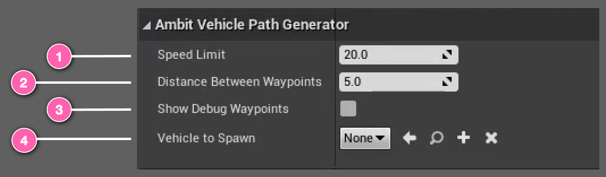
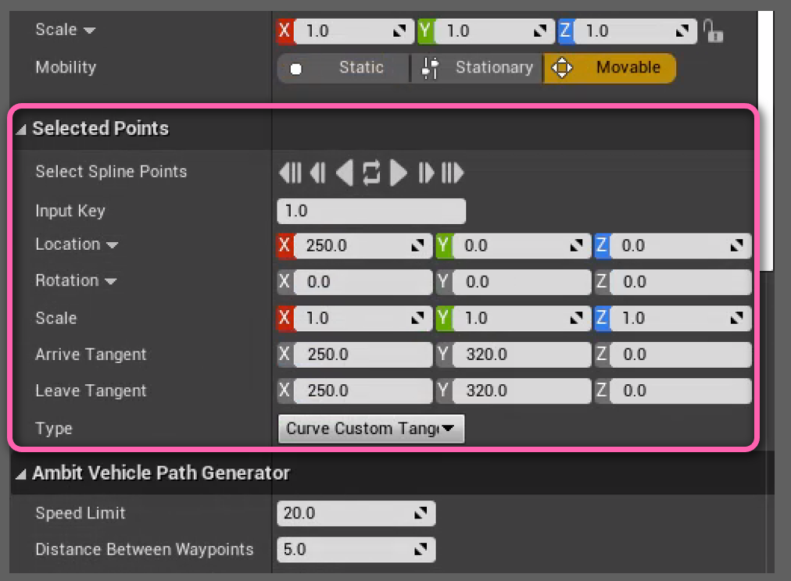
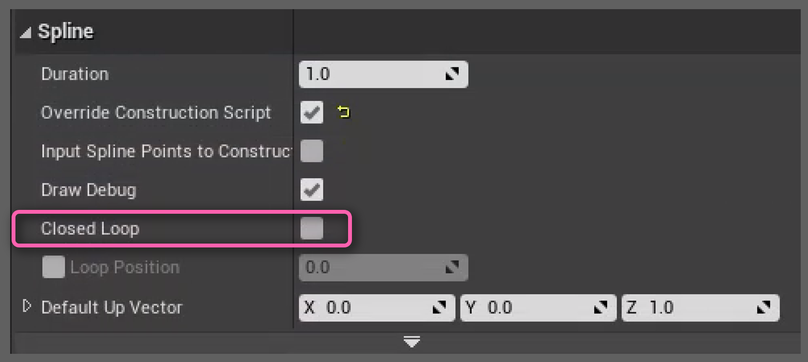
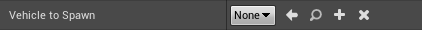

# Spawn Vehicle Path Actor

The **Spawn Vehicle Path** actor can be used to generate a path and spawn a single vehicle running along this path by easily doing drag-and-drop, configurating parameters and tweaking the curves.

The **Spawn Vehicle Path** tool works by using the position of the **Spawn Vehicle Path** actor and the pre-made _spline component_ attached to the actor to determine the path of the vehicle, which will run along the determined path. At runtime, a list of Waypoints will be generated along the path/curve defined by the spline. They will be separated by the fixed distance specified by <number-badge>2</number-badge> (unit in meter). At the same time, a copy of vehicle which can be set at <number-badge>4</number-badge> in class ([AWheeledVehicle](https://docs.unrealengine.com/4.27/en-US/API/Plugins/PhysXVehicles/AWheeledVehicle/)) will be instantiated at the beginning of the path. The vehicle will try follow the path by reaching each waypoint from beginning and achieve the speed limit (unit in km/h) set at <number-badge>1</number-badge>. Besides, for debugging purpose, <number-badge>3</number-badge> can be toggled to visualize the waypoints at runtime.

## Using Spawn Vehicle Path

You can use one or more **Spawn Vehicle Path** instances within a scene. To add an instance, drag-drop the **Spawn Vehicle Path** class from the **Content Browser** or the **AWS Ambit** category tab in the _Place Actors_ panel into your map. You'll find the class under **"Ambit C++ Classes/Ambit/Actors/Spawners"**.

After adding an **Spawn Vehicle Path** to your map you will see an icon like this. You should place it at a 3D location where it's on or above the surface/ground you'd like the vehicle to spawn. 

The _position_ of the **Spawn Vehicle Path** instance is the default starting point of the spline path. You can **transform** the **Spawn Vehicle Path** instance by rotation, translation, and scaling to adjust the orientation, position, and length of the spline. You can also add more spline points or manipulate each spline point directly in the **viewport** or through the **Selected Points** category of the Details panel.

In fact, a better way to construct and view the whole path is to switch to the Orthographic view of camera and manipulate the spline points there.

Within the **Spline** component panel, you can also toggle the **Closed Loop** check box to make the spline a closed loop which will connect the last spline point to the first spline point automatically. The spawned vehicle will then run infinitely along the loop instead of stopping at the end in a normal open spline.

Vehicle to spawn set has to be of class or a derived class of [AWheeledVehicle](https://docs.unrealengine.com/4.27/en-US/API/Plugins/PhysXVehicles/AWheeledVehicle/).

Example vehicle blueprint assets can be found in Unreal Marketplace like [this](https://www.unrealengine.com/marketplace/en-US/product/bbcb90a03f844edbb20c8b89ee16ea32) or you can follow Unreal tutorial [here](https://docs.unrealengine.com/4.27/en-US/InteractiveExperiences/Vehicles/VehicleUserGuide/) to create your own vehicle asset. 

## Examples

If you set everything up, you should see the spawned vehicle running along the path with optional display of waypoints.
