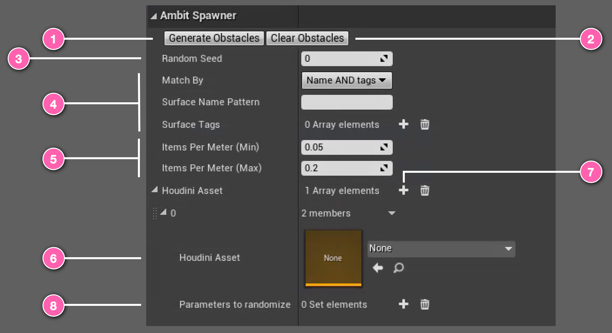

# Spawn with Houdini Digital Assets Actor

Ambit provides a tool to enable easy placement and randomization of your Houdini Obstacles. This tool is called **Spawn with Houdini** actor and operates very similarly to the [Spawn on Surface](/spawn-on-surface/) Ambit Spawner.

> ⚠️ **Important:** This spawner type leverages the Houdini Engine. Be sure you have installed both the Houdini Engine and the Houdini plugin for Unreal before using this tool. See the [Setup](../setup) section of this user guide for instructions.

## Using Spawn with Houdini

The **Spawn with Houdini** works very similarly to the [Spawn on Surface](/spawn-on-surface/). The main difference being that you can trigger the generate by the *Generate Obstacles* button while in the editor, and can specify Houdini Digital Assets to be selected as what to spawn.

*Houdini Digital Assets (HDAs)* have the ability to surface user parameters for a user to update to customize what look the obstacle has. 

While in the editor mode, the **Spawn with Houdini** instance allows users to <number-badge>1</number-badge> *generate* many instances of an HDA which then randomizes the "seed" parameters of the HDA. By generating the obstacles here, you can pre-cook the HDAs to the screen to save on loading later. Obstacles generated at this phase will not regenerate when pressing play, nor be deleted once the play has finished.
If you are not happy with the results or want to clean your world of these spawned obstacles - simply click the <number-badge>2</number-badge> *Clear Obstacles* button.

You can always change the randomization of locations and parameters by updating the <number-badge>3</number-badge> *Random Seed*.

To dictate where the obstacles are spawned a <number-badge>4</number-badge> similar form can be filled out as the [Spawn on Surface](/spawn-on-surface/) to match by _Surface Name Pattern_ and/or by _Surface Tag_. The number of generated obstacles can be controlled using the <number-badge>5</number-badge> _density_ range.

The user can select which HDA they want to spawn in bulk by selecting it as the <number-badge>6</number-badge> *Houdini Asset* from the dropdown. **Note:** This asset must already be imported into Unreal Engine via the Houdini Plugin.

While in the play mode, the **Spawn with Houdini** will automatically generate with the settings specified. These assets will also automatically be removed once the play has finished. 
**Note:** The **Spawn with Houdini** will only generate obstacles in play mode if there has not already been spawned actors from the editor mode. 

## Further Usage

Multiple **Spawn with Houdini** actors can be placed on the scene, allowing users to create any number of settings to place HDA to the screen. 

If you wish to spawn more assets using the same configuration, press the <number-badge>7</number-badge> + symbol on top this will add a new entry. Expand the selection that appears to put in a different HDA to spawn. One of the HDA from this list will spawn on the locations that are available to spawn.  

You can customize which parameters are randomized from an HDA by adding their value into the <number-badge>8</number-badge> _Parameters to Randomize_ section. These are the underlying parameter names in the HDA, and can be added so that specific part is randomized when the object is created. If you do not specify anything, **Spawn With Houdini** will automatically look for the "seed" parameter of the HDA and place this in the list automatically.