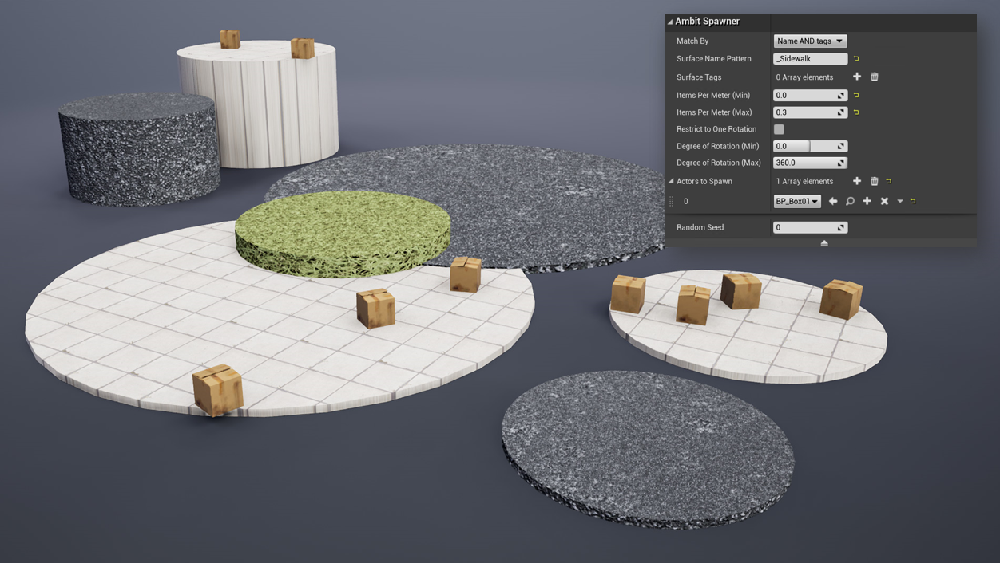
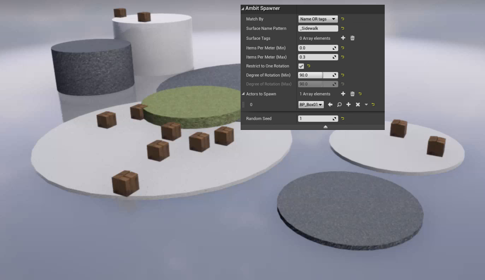
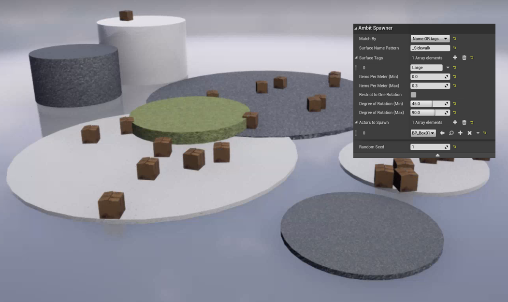
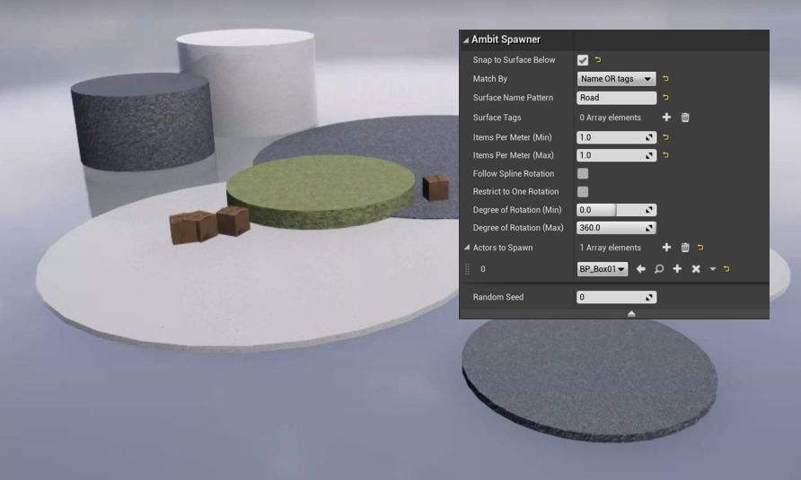

# Examples

<TODO: Update all images to reflect new behavior and interfaces>

## Spawn on Surface Examples

The following examples help illustrate the effect of each of the **Spawn on Surface** parameter. Each example uses the scene detailed below.

### Example #1

Placement by surface name only.

### Example #2

This example is the same as above with only the **Random seed** value changed. Not only does this result in different placement of the boxes, it also results in a different density, randomly chosen from within the specified range.

### Example #3

Placement by tag only.

### Example #4

Placement requiring both surface name **and** tag to match the provided values.

### Example #5

Placement requiring either surface name **or** tag to match the provided values.

### Example #6

Placement requiring both surface name **or** tag to match the provided values, and with rotation restricted to one rotation (90 degrees).

### Example #7

Placement requiring either surface name **or** tag to match the provided values, and with rotation restricted to a range (45-90 degrees).

### Example #8

Placement requiring either surface name **and** tag to match the provided values, and with two Unreal Engine actor types to spawn.

## Spawn in Volume Examples

### Example 1

Placement by bounding box only, without _Snap to Surface Below_ or specified surfaces.

### Example 2

Placement by bounding box and _Snap to Surface Below_, without specified surfaces.

### Example 3

Placement by bounding box and specified surfaces.

## Spawn on Path Examples

### Example 1

Placement by spline only, without _Snap to Surface Below_ or specified surfaces.

### Example 2

Placement by spline and _Snap to Surface Below_, without specified surfaces.

### Example 3

Placement by spline and specified surfaces (name pattern _Road_).

### Example 4

Placement by spline, _Snap to Surface Below_, and _Follow Spline Rotation_. The spline was edited to include a curve.

