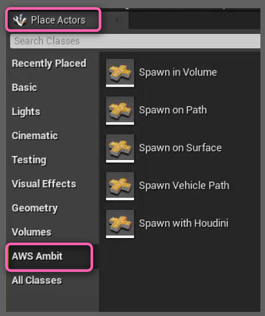

# Ambit Static Item Generation

Ambit provides several drag-and-drop tools to enable easy placement of static items in your simulation scenarios. The collection of these tools are referred to as **Ambit Spawners**. 

- [Spawn on Surface](/spawn-on-surface/)
- [Spawn in Volume](/spawn-in-volume/)
- [Spawn on Path](/spawn-on-path/)

While there are variations between these tools, the three of them share most of their functionality. **Spawn in Volume** and **Spawn on Path** have a couple of extra parameters, since they provide higher level of customization, but they work in a similar way to **Spawn on Surface**.

All Ambit Spawner tools utilize two of Unreal Engine's custom collision channels: ECC_GameTraceChannel1 and ECC_GameTraceChannel2. These are used for collision detection by the obstacles spawned by the Ambit Spawner tools.

These actor classes can be found in the **AWS Ambit** category of the _Place Actors_ panel.

## How To Use Spawners

You can use one or more Spawner instances within a scene. To add an instance, drag-drop the Spawner class from the the **AWS Ambit** category tab in the Place Actors panel or Content Browser into your map. You'll find the classes under "Ambit C++ Classes/Ambit/Actors/Spawners".

After you place the spawners in the viewport and setup all parameters, you can enter the play mode by clicking the play button and it will spawn the assets.

### How To Use Tags

> **CAUTION!** *The UE Editor's UI for adding actor tags is confusing. Be sure to follow the steps below when using tags.*

To tag an actor, follow these steps:

1. Select the actor in your map or in the **World Outliner**.

2. In the **Details** tab, use the "Search details" field to search for the word "*tags*". You will see the following. Use the **Actor > Tags** array property, *not* the **Tags > Component Tags** array property. You can add tags clicking the ✚ icon. You can delete a tag by clicking the ▾ icon next to the tag and selecting "Delete".

   
