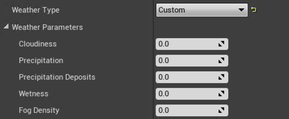
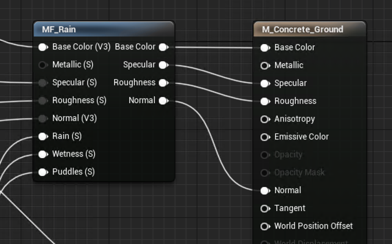

# Ambit Weather System

This section will cover how to set up Ambit Weather System and how to use it to generate time of day and weather scenarios.

## Setting Up Ambit Weather in Your Scene

- First make sure you delete any existing lights for the sun, moon, and skylight, as well as any existing fog actors, or sky atmosphere actors from your scene to avoid potential conflicts of lights.

- Drag the Ambit Weather actor **BP_EnvironmentFX** into your scene from Ambit/EnvironmentFX folder.

- You can change the Mobility category for the components but please make sure the Mobility of Directional Light Component is always set to Moveable.

- You can also use the TestWeatherMap in the EnvironmentFX/TestMap folder that has already set up Ambit Weather.

- To use the Ambit Weather System, start a play session with either of the following preview types: Play In Editor (PIE) by pressing Play Button or Simulate In Editor (SIE) preview by the Play dropdown menu (Alt + S). If you use PIE, please enter F8 so you can get your mouse cursor to control the Editor Mode panel.

## Changing the Time of Day

- Change the Time of Day slider in Ambit Editor Mode to adjust the time of day. The range of Time of Day slider is from 0.0 to 23.99999 which is to simplify solar time setting.

- You can use the Preset Time of Day dropdown menu to select "Morning" (6.0), "Noon" (12.0), "Evening" (18.0), or "Night" (0.0) scenario.

    

## Changing the Weather

- You can select the preset weather type from Weather Types dropdown menu: Sunny, Rainy and Foggy.

    

- You can also change the Weather Parameters to customize the scenario. Our current Weather Parameters contain Cloudiness, Precipitation, Precipitation Deposits, Wetness, and Fog Density.
    - The Cloudiness is to control the clouds coverage.
    - The Precipitation is to control the rain intensity.
    - The Precipitation Deposits is to control the puddles.
    - The Wetness is to control the wetness intensity in the rainy day.
    - The Fog Density is to control the fog thickness or concentrations.
  
    

## Setting Up Material Effects

- AmbitWeather requires that you make some modifications to your scene's materials so that they'll appropriately reflect the various weather attributes like "Wetness". To accomplish this, we've provided a special material function called "MF_Rain". You simply add this material function to each of your materials using the Material Editor to make your materials AmbitWeather-compatible. Here's how:
    - Drag the "MF_Rain" material function from EnvironmentFX/Rain folder into your materials or right-click a blank place in your Material Editor and search for "MF_Rain".
    - Connect inputs: Base Color, Normal, Rain, Wetness and Puddles are required inputs. Metallic, Specular and Roughness are optional.
    - Connect outputs: Base Color, Specular, Roughness and Normal.

- The "MF_Rain" can make surfaces wet, and generate rain drop, rain drip, puddles, and ripples effects.

    

- You can find some example materials with the rain material function in EnvironmentFX/Example_Materials.
